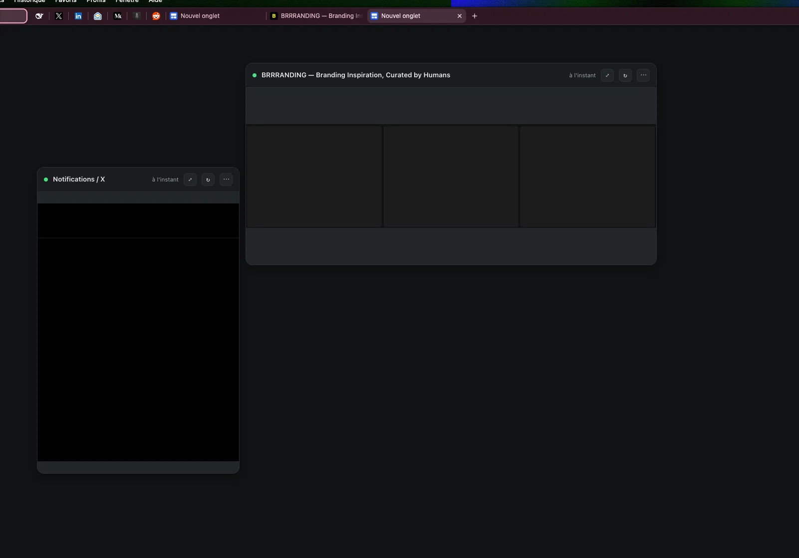

# Boardmine

> Turn your Chrome New Tab into an ambient, glanceable dashboard. Clip auto-updating visual widgets from any web page — dashboards, analytics, feeds, or internal tools behind login. 100% local, private, and session-aware.

A private, local reimagining of Arc's **Live Previews** for Google Chrome (Manifest V3).

- **100% Local & Private**: No cloud, no remote server, no analytics, no telemetry.
- **Session-Aware**: Captures run inside your Chrome profile, preserving your existing sessions and cookies.
- **Magnetic Freeform Board**: Free-placement canvas with edge snapping, homothetic card resizing, hover-revealed actions, and a refined dark frosted glass aesthetic.
- **Zero Build Step**: Pure vanilla JavaScript, modern CSS and HTML. No npm, no framework overhead.



## Install

1. Clone or download this repository.
2. Navigate to `chrome://extensions`.
3. Enable **Developer mode** (top-right toggle).
4. Click **Load unpacked** and select the `boardmine` directory.
5. Open a new tab to see your live board.

## Use

1. Go to any page you want to monitor (log in first if needed).
2. Click the extension icon → **Capture a zone of this page**.
3. Drag a rectangle over the target area, fine-tune using the corner/edge handles, then press **Enter** (Esc to cancel).

A snippet is created, captured immediately, and opens right on your New Tab board.

On your New Tab page:

- **Move & Scale**: Drag cards anywhere; resize from the bottom-right handle. Cards retain the exact aspect ratio of the capture and softly snap to adjacent edges.
- **Hover Controls**: Actions stay invisible until hover — **↻** to refresh immediately, **⋯** for menu options (open site, redefine crop area, rename, change interval, pause, delete).
- **Source Pill**: The discreet top-right pill indicates the origin domain and opens the live page on click.
- **Card Click**: Clicking the capture navigates directly to the target URL.

The default refresh interval is 15 minutes (customizable per snippet or globally in **Settings**).

## Boards

Snippets are organized into **boards** (e.g. Work, Personal, Finance). Each snippet belongs to exactly one board, chosen in the popup before you capture.

- **Switch boards**: click the board name in the top bar of the New Tab page. The dropdown lists your boards, and lets you create, rename or delete the current one.
- **Board shown on New Tab**: every new tab always opens the board you pinned with the pin icon in that dropdown — not the last one you looked at.
- **Open a board in any tab**: every board has a stable URL, `chrome-extension://<id>/newtab.html?board=<boardId>`. Use the **↗** button next to a board name in the popup to open it, then bookmark or pin the tab. Several tabs can show different boards at once.
- **Refresh all** on a board only refreshes that board; the periodic refresh keeps running for every board.
- Deleting a board erases its snippets and their captured images. The last remaining board cannot be deleted.

On upgrade from 0.3.x, existing snippets land in a board named **Main**. Config exports are now `version: 3` and include boards; older exports import into **Main**.

## About the "debugging this browser" bar

Every capture briefly surfaces this indicator for a few seconds:

> *Une extension a commencé à déboguer ce navigateur* / *"Boardmine" started debugging this browser*

This is standard Chrome behavior. The extension utilizes `chrome.debugger` (Chrome DevTools Protocol) because it is the only native browser API capable of capturing an accurate, non-visible background tab with custom clips and viewport emulation. Nothing leaves your machine. The notification dismisses automatically once capture completes.

Clicking **Cancel** on the bar simply halts the active capture gracefully.

To permanently silence this bar, start Chrome with:

```bash
--silent-debugger-extension-api
```

*(On macOS: `open -a "Google Chrome" --args --silent-debugger-extension-api`)*. This flag only suppresses the banner UI without altering extension permissions.

## Black or empty captures

If a snippet yields a blank or partial capture (e.g. X/Twitter, dynamic single-page apps, lazy-loaded charts), the target site may delay painting while backgrounded. Built-in mitigations include visibility emulation and pre-scrolling. If issues persist:

1. **Settings → Use a dedicated capture window**: Renders through a transient, unfocused mini-window treated as fully active by Chrome. It closes automatically once the queue finishes.
2. **Fine-tune timing**: Increase **Delay after load (ms)**, or specify **Wait for selector before capture** with a CSS selector matching a rendered element.
3. **Infinite feeds**: Uncheck **Pre-scroll the page to load lazy images** if automatic scrolling triggers unwanted pagination.

Hover over any status pill in Settings or the extension popup to view precise execution diagnostics.

## How it works

For each snippet in the queue:
1. Spawns an isolated capture tab (or dedicated popup window).
2. Attaches `chrome.debugger` (CDP 1.3).
3. Overrides device metrics to mirror the original capture viewport.
4. Emulates foreground visibility (`document.visibilityState`, focus, requestAnimationFrame).
5. Navigates to target URL and awaits `loadEventFired` + custom selector / settling delay.
6. Detects session expiration or login redirects (preserving the previous clean snapshot).
7. Eagerly primes lazy images and font readiness.
8. Measures anchor coordinates and issues `Page.captureScreenshot` (WebP format).
9. Verifies frame entropy (auto-retrying if a blank frame is detected).
10. Detaches debugger and tears down the capture tab in a guaranteed `finally` block.

Snapshots reside in **IndexedDB**, configurations in `chrome.storage.local`, and queue state in `chrome.storage.session` for resilience across service worker cycles.

## Limits

- Captures require a brief background tab or popup window lifecycle.
- Pages requiring multi-factor authentication (2FA) must be re-authenticated manually when sessions expire; previous captures remain displayed with an alert badge.
- Internal `chrome://` URLs, Chrome Web Store items, and native PDF viewer pages cannot be scripted by extensions.

## Architecture

```
manifest.json   MV3 declaration & permissions
background.js   Service worker: alarm orchestration, queue, message dispatch
capture.js      CDP pipeline: visibility spoofing, lazy priming, clip measurement
picker.js       Interactive selection overlay with 8-point handles & DOM anchor detection
newtab.*        Board page (New Tab and ?board=<id> URLs): free canvas, edge snapping, board switcher
options.*       Settings interface, snippet editor & JSON configuration backup
popup.*         Extension action popup: quick status & capture triggers
storage.js      Persistence schema (boards, snippets, settings, meta) & geometry math
db.js           IndexedDB blob storage for WebP captures
```

MIT License.
